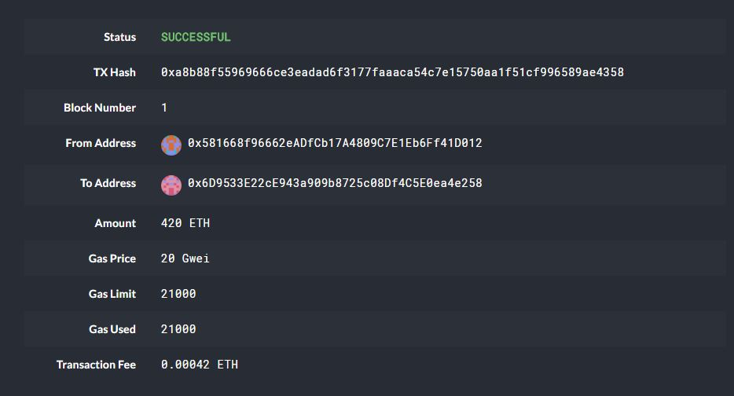

# mini_blockchain
a testnet blockchain using Puppeth, Geth, &amp; the Clique Proof of Authority algorithm

---
## Setup
links:
- Download & install the MyCrypto Desktop App for your OS at https://download.mycrypto.com/
- Download the most recent **GETH & TOOLS** for your OS and version (32 or 64 bit )at https://geth.ethereum.org/downloads/
    - extract the contents to a location easy to reach and rename the folder blockchain-tools or something similar
---
## Code Guide for blockchain setup
1. Create Accounts/Nodes
    - `./geth --datadir poa_node1 account new` 
    - `./geth --datadir poa_node2 account new `
    - "use geth to create a data directory for each node's new account information"

2. Block Genesis (press enter after completing each step)
    - `./puppeth` 
        - name your network (mine is toutengnet)
        - configure new genesis from scratch: option 2;1
        - choose consensus algorithm (clique- PoA)
        - paste addresses to be prefunded without the first 0x 
        - choose **NO** for prefund with 1 wei
        - input & **REMEMBER** a chain ID (mine is 123) & password when prompted (shuiguosauce)
        - I left blocktime at default 15 seconds, which is just the time it takes to mine a new block
        - when genesis is completed, `manage existing genesis` and then `export genesis configurations`

3. Initialize & Mine (the two lines of command line code will be run in separate windows; one for node1 & one for node2)
    - Init
        - `./geth --datadir poa_node1 init toutengnet.json`
        - `./geth --datadir poa_node2 init toutengnet.json`
    - Mine
        - `./geth --datadir poa_node1 --unlock "poa_node1_address" --mine --rpc --allow-insecure-unlock`
            - **IMMEDIATELY** copy the self-enode from the first node to paste into the long portion starting with "enode" below

        - `./geth --datadir poa_node2 --unlock "poa_node2_address" --mine --port 30304 --bootnodes "poa_node1_enode_address@127.0.0.1:30303" --ipcdisable --allow-insecure-unlock`
        - make sure where it says port, the number is different from the one from the enode of node1

At this point, both nodes should be running. Keep them running during the next set of steps.

---
## MyCrypto Setup and Transaction Generation

Network Setup
- In the MyCrypto app, change network to "Add Custom Node" then create the node using information setup from the block genesis. 

- The network should be set to custom, currency to ETH, and chainID is the same from the genesis. Save & Use when finished.
    - Note the URL is the same as the sample just **http://** instead of https://.
    

Wallet Setup
- In Create New Wallet, select Generate a Wallet and then choose keystore on the following screen. Place the file in the data directory containing your mining node info. 

Accessing the Wallet
- In View & Send, choose keystore and then select the keystore file in the mining node folder, followed by typing in the password from block genesis in the space. 

Transaction
- Select Send Ether from the top bar, then input the address to send ETH to and the amount to send. 
- Feel free to mess with the fees, just note that in real transactions paying higher fees will usually equate to a better probability your transaction is verified on the blockchain. Hit send and then confirm on the next popup.
- After successfully sending the transaction, a TX status green box will appear at the bottom with a hash indicating the transaction. 

- This hash can be copied and the status can be viewed in the TX Status section

